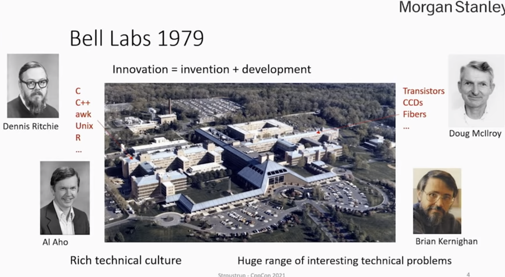

# Overview
  1. C++의 탄생
  2. "The design and evolution of C++"
  3. Will C++20 deliver on the dreams of D&E?
  4. The future


## C++의 탄생

c++는 1979년 bell 연구소에서 시작되었다



> It's not enough to have an idea. You have to work hard to make them work

### The earlist aims - Day@1
  - 분산시스탬을 연구하면서 하드웨어를 효율적으로 활용하고, 복잡성(class 와 strong static type checking을 통한)을 관리할 필요가 생겨났다. 기존에 C언어가 존재하였으나, 이 두 문제를 동시에 해결할 수 없었다.

  처음엔 완벽한 언어를 만드려하지 않았습니다. 개발자는 C에 class 개념을 추가하고 싶었기 때문에 프로제트를 시작하였고, C++을 진화하기위에 디자인되었습니다. 

#### argument checking -1980

- C in 1979 aka "Classic C"
```C
double sqrt();
dobule x = sqrt(2);

char * strchr(str, ch) char *str; { ... }
strlen(str) char *str; { ... }

int y = foo("hope"); /* might link, might crash */
```
- C with classes in 1980 (C and C++ today)
``` c++

double sqrt(double); //argument type required
double x = sqrt(2);

char* strchr(char* str, int ch) {...} // int not optional 
int strlen(char* str) { ... }

int foo(char*)    //declaration required
int y = foo("hope");

```

static cheching was first steps towards it


### Argument type checking - 1983
기존 c 코드와 호환되지 않는 c++ 코드들은 많은 사람들에 비판을 샀습니다. 하루에 10000줄의 코드가 c에서 c++로 convert되었고 type checking, overloading, adding user-defined types, consistent linking은 모두 c++의 중요한 부분이며 하나의 부분이라도 없다면 c++을 시작할 수 없습니다. 

현제에도 존재하는 c++문제들
  1. implicit narrowing conversions
    - char x = 7.9  //truncation                    //"Don't break the code
    - char y= 567; //probability truncation         // Offer alternatives to "problem featurs"
    - To compensate, use {} initialization: char x{7.9}; //error:narrowing conversion won't compile.


  2. Linkage
    - global function is  by default external
    - To compensate, use module

  3. Some C/C++ incompatibilites came from C rather then C++
    - Scope of consts 
    - Implicit pointer conversion from void* to T* (never C++)


  ## Key idea: "Represent concepts in code"

  C++ 을 잘 작성하기 위해서 가장 중요한것은 컨셉들은 코드안에 보여주는것 입니다(주로 클래스를 사용해서). 
  1. Direct Representation of ideas in code. 
  2. Make code mroe declarative
  3. Make more information available to compilers
  Early example: Vector, String, file handle, concurrent task, message queue, hash table, grpahical shape, complex number, infinite integer 

  ## RAII - 1979
  In 1979:
    new function creates the run-time environment for member functions, A delete"function is reverse that

  Later(1983):
    "new function" -> constructor
    "delete function" -> destructor
    This is because new and elete were not just for new and delete functions

  A Slightly later formulation(1980s)
    A Constructor establishes a class invariant(if any) for an object
    A destructor releases all resources owned by the object

  1988:
    "Resourece Acquisition is initialization

  1981:
  Needed Control assignment
    - User defined operation=

    - A recurring problem: avoid expensive copying
      - always possible but tricky for users
      - return value optimization from 1982

    
  2011:
    - Need to control movement of object between scopes
      - move operation
      - "Move semantic" completes the object model

  2020:
    Improved an guaranteed copy elision